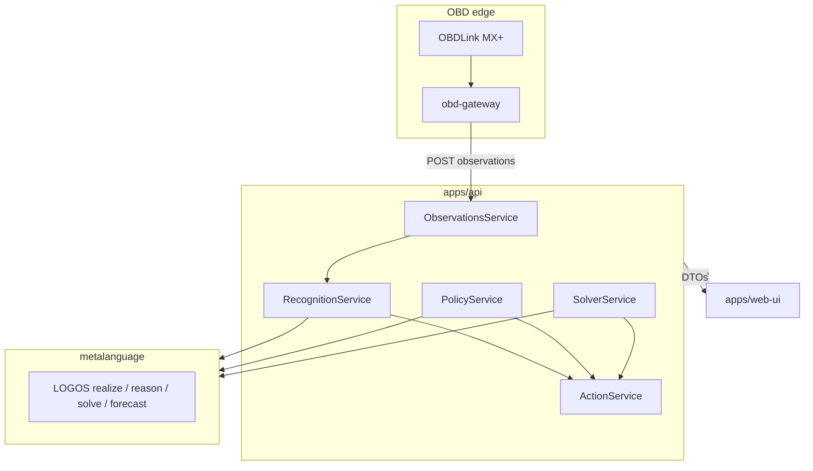

# Architecture & Technical Reference (as-built)

This is the thorough, *as-built* technical document for `auto-architect`.
It explains how the system actually works today, the contracts between layers,
what is deliberately deferred, and the known limitations worth fixing early.

For *normative rules*, see `docs/ai/*`. For orientation, see `docs/AI_HANDOFF.md`.
For backlog, see `docs/FUTURE_FEATURES.md`.

---

## 1. The one invariant

Everything serves one chain:

```
Ontology → Validation → API → Store → UI / OBD edge → Actions → Decisions
```

- **Ontology owns meaning.** If a fault class or role is not in
  `packages/ontology`, it does not exist.
- **Validation guards the gate.** Untrusted input (UI, obd-gateway) is Zod-
  validated before storage or action.
- **API exposes semantic contracts.** Reads through resource endpoints; state
  changes through action endpoints that go through `ActionService`.
- **Store holds validated facts** keyed by stable semantic IDs (in-memory today).
- **UI / obd-gateway visualize and report.** They never own fault meaning.
- **Actions → Decisions.** Mutations emit `DecisionRecord`s that preserve *why*.

If the software cannot say *what was observed, which fault class is proven, what
action is allowed, and why a recommendation was ranked* — it is not semantic yet.

---

## 2. Component map

```
apps/
  web-ui/         React 19 + TanStack Router/Query + Redux Toolkit + Tailwind v4
  api/            Fastify 5 + Zod + in-memory store
  obd-gateway/    Python + python-OBD → Observation batches

packages/
  ontology/       dl-ontology.json, vehicle-profiles, DTC dictionary, campaigns
  semantic-types/ shared camelCase types
  validation/     Zod input contracts
  logos-bridge/   Node ↔ LOGOS seam (+ FakeLogosBridge)
  cartridges/     perception + framing (generic + engine-family)
  game-theory/    pure decision/zero-sum/cooperative math
  api-client/     typed UI↔API bridge + TanStack queryKeys
```

Dependency direction (nothing points "up" toward an app):

```
semantic-types ← ontology ← validation
      ↑            ↑
      └──────── cartridges ──┘
        ↑
   logos-bridge
        ↑
     apps/api
apps/web-ui ← api-client ← semantic-types
apps/obd-gateway ← (HTTP only; no TS packages)
```

---

## 3. Data flow



**Never skip a layer:** `obd-gateway` does not call LOGOS. The UI does not write
the store. Handlers do not mutate state except via `ActionService`.

---

## 4. Ontology & multi-vehicle selection

| File | Role |
|---|---|
| `packages/ontology/dl-ontology.json` | DL TBox: classes, roles, views |
| `packages/ontology/vehicle-profiles.json` | Vehicle → engine family → view + cartridges |
| `packages/ontology/dtc-dictionary.json` | Curated DTC → description / concept |
| `packages/ontology/pid-dictionary.json` | Thin SAE J1979 seed: units + Mode 01 hex |
| `packages/ontology/known-campaigns.json` | W80 / W84 / TSB 05047457A matcher inputs |

**Views:**

- `generic` — SAE-common fault classes (misfire, lean, EVAP, cam/crank, oil trend)
- `fca-tigershark-2.4` — generic + `MultiAirOilStarvation`

`VehicleService` resolves a vehicle's engine family, which selects the TBox view
slice and the cartridge list. Adding a Silverado means filling
`veh:silverado-tbd` / `gm-ecotec3-tbd` and fleshing `gm-ecotec3-stub.ts` — not
forking the generic TBox.

---

## 5. Cartridges

Each cartridge in `packages/cartridges` packages:

1. **Perception** — PID/DTC thresholds → ABox assertions (`hasDtc`, `hasCondition`, …)
2. **Framing** — proven class → `DiagnosticProblem` draft with `desiredState.successCriteria`
   and a ranked candidate-action playbook

Registered today: `misfire`, `lean-fuel`, `evap`, `cam-crank-correlation`,
`fca-tigershark-2.4`, plus inert `gm-ecotec3-stub`. Catalog/cartridge parity is
enforced by `pnpm lint:ontology` and `packages/cartridges/src/ontology-lint.test.ts`.

---

## 6. API services

| Service | LOGOS primitive | Responsibility |
|---|---|---|
| `RecognitionService` | `realize` | Prove fault classes from observations; never synthesize "Healthy" |
| `PolicyService` | `reason` | Safety holds (e.g. forbid clear-codes-and-drive) |
| `SolverService` | `solve` | Rank diagnostic/repair actions |
| `ForecastService` | `forecast` / trend helpers | Oil-level decline → `ChronicOilConsumption` evidence |
| `ActionService` | — | Sole mutation gate + `DecisionRecord` audit |
| `ObservationsService` | — | Ingest batches; expose DTCs / freeze frames / Mode 06 |
| `CampaignsService` | — | Match vehicle vs known recalls/TSBs |
| `RecommendationsService` | — | Surface ranked next steps to the UI |
| `VehicleService` | — | Profiles, engine families, view resolution |

**FOL atom sanitization:** LOGOS `reason` formula parsing rejects hyphens/colons
in individual IDs. `PolicyService` uses `folSafeAtom` to rewrite
`veh:jeep-renegade-2015-latitude` → `veh_jeep_renegade_2015_latitude` for
facts only (`realize` JSON ABoxes are unaffected).

---

## 7. API surface (current)

Resource reads:

- `GET /health`
- `GET /api/vehicles`, `POST /api/vehicles`, `GET /api/vehicles/:id`
- `GET /api/engine-families`
- `POST /api/vehicles/:id/observations` (202)
- `GET /api/vehicles/:id/{dtcs,freeze-frame,mode06,forecast,recognition,recommendations,campaigns,problems,decisions}`
- `GET /api/problems/:id`

Action / mutation:

- `POST /api/actions/create-diagnostic-problem`
- `POST /api/actions/solve-diagnostic-problem`
- `POST /api/actions/log-repair`
- `POST /api/vehicles/:id/actions/clear-codes-and-drive` (policy-gated)
- `POST /api/vehicles/:id/recommendations/refresh`
- `POST /api/recommendations/:id/status`

No auth today. No OpenAPI export yet (garden has it; auto deferred).

---

## 8. UI

Routes (`apps/web-ui/src/router.tsx`):

| Path | Page |
|---|---|
| `/` | Dashboard — DTCs, recognition, oil trend, recommendations |
| `/diagnosis` | Proven classes, draft/solve problems, safety-hold demo |
| `/problems/$problemId` | Solution + ranked actions + log repair |
| `/campaigns` | Recall / TSB matcher |
| `/journal` | Decision records |

Stack conventions match garden: TanStack Query for server state; Redux for
durable client UI (`selectedVehicleId`, `debugMode`). There is no shared
`@auto/ui-components` package yet — pages are self-contained.

---

## 9. OBD gateway

Python app (`apps/obd-gateway`) using `python-OBD` against ELM327-compatible
adapters (OBDLink MX+). Modes of interest: 01 (PIDs), 02 (freeze frame),
03/07/0A (DTCs), 06 (on-board monitors). CLI: `scan`, `watch`, `--simulate`,
`--manual-pid`, `--simulate-dtc`, `--dry-run`.

Normative rules: [`docs/ai/OBD_EDGE_CONTRACT.md`](ai/OBD_EDGE_CONTRACT.md).
Operator detail: [`apps/obd-gateway/README.md`](../apps/obd-gateway/README.md).

---

## 10. Testing & CI

- TypeScript: Vitest per package (`pnpm -r test`) — includes API HTTP smoke
  (`apps/api/src/app.smoke.test.ts`) and ontology Zod/registry parity
- Lint/format: Biome (`pnpm lint`) — see `docs/ai/CODE_STANDARDS.md`
- Python: pytest (`pnpm obd-gateway:test`)
- Ontology: `pnpm lint:ontology` (LOGOS well-formedness + narrow parity vitest);
  healthcheck uses `--wellformed-only` after `pnpm -r test` already covered parity
- Real-LOGOS smoke: `packages/logos-bridge/src/*-integration.test.ts` — self-skip
  without LOGOS; CI runs them for real only in the `ontology-lint` job
  (`verify` deliberately omits the LOGOS install)
- Bridge-drift (advisory): `pnpm check:bridge-drift` vs garden-architect's `@garden/logos-bridge`
- One-shot local gate: `pnpm healthcheck` (typecheck∥biome + tests + well-formedness +
  gateway + UI build + drift check; auto-sets `LOGOS_PYTHON_BIN` to `.venv` when present)
- CI: `.github/workflows/ci.yml` — `verify` (Fake path) + `ontology-lint` (real LOGOS)

Unit tests that need LOGOS behavior without Python inject `FakeLogosBridge`.
Required layers are listed in `docs/ai/TESTING_DEV_GUIDE.md`.

---

## 11. Deliberately deferred

See [`FUTURE_FEATURES.md`](FUTURE_FEATURES.md). High-level:

- Postgres (and durable observation history)
- Auth / multi-user
- Shared UI component package / typed API client
- Propose-only LLM agent service
- Richer live gauges and Mode 06 visualization
- Full Silverado engine-family cartridge (stub only today)
