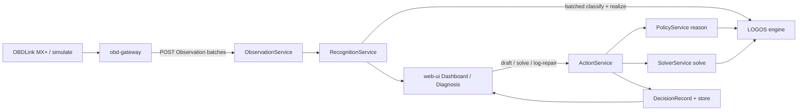

# Auto-Architect — Complete Walkthrough

This document is the **narrative tour** of auto-architect: *why* it is built
this way (theory), *what* you can do with it (features), and *how* it is wired
(technology). It complements — and does not replace — the as-built contracts in
[`ARCHITECTURE.md`](ARCHITECTURE.md), the orientation ledger in
[`AI_HANDOFF.md`](AI_HANDOFF.md), or the backlog in
[`FUTURE_FEATURES.md`](FUTURE_FEATURES.md).

**Audience.** New contributors, AI agents joining mid-project, and operators who
want the whole picture before diving into code or the OBD adapter.

**Related deep dives.** Shared propose/dispose theory + LOGOS workshop:
[`LESSON_AGENT_DETERMINISTIC_APPS.md`](LESSON_AGENT_DETERMINISTIC_APPS.md)
(pointer → metalanguage). Automotive coding rules:
[`ai/README_FOR_AI.md`](ai/README_FOR_AI.md).

---

## 1. What this system is trying to be

**North star — “You are the vehicle.”**

Learn everything lawfully available from OBD-II / CAN (and guided enhanced
sessions when scoped): be informed, recommend, decide, enact or guide actions,
and remember outcomes for sure reference. The operator should experience a
principled companion that models the vehicle’s state — not a chatbot that
guesses codes, and not a black-box ranker that hides its evidence.

**First concrete vehicle.** A 2015 Jeep Renegade Latitude (2.4L Tigershark
MultiAir2), built so a second vehicle (e.g. Silverado) is an engine-family +
cartridge addition, not a rewrite.

**Sibling pattern.** Same architecture as garden-architect: LOGOS disposes;
domain meaning lives in ontology + cartridges; the edge only reports
observations. Prefer copying *patterns* from garden, not garden plant vocabulary.

---

## 2. Theory — how meaning and trust work

### 2.1 Propose / dispose (the one invariant)

> **Heuristics and LLMs may propose. The formal engine disposes.**

| Layer | Allowed to… | Forbidden to… |
|---|---|---|
| Cartridges / UI / future LLM | Suggest framing, candidate actions, playbook order | Self-certify a fault class or safety clearance |
| LOGOS `realize` | Prove which fault classes follow from evidence | Invent membership from nothing |
| LOGOS `reason` | Enforce safety policy (holds) | Be bypassed by a “just this once” UI path |
| LOGOS `solve` | Rank next actions under constraints | Present guesses as calibrated probabilities |
| `obd-gateway` | Capture and POST validated observations | Classify faults or call LOGOS |
| `ActionService` | Mutate state + emit `DecisionRecord` | Be skipped by handlers or the UI |

If the software cannot say *what was observed, which class is proven, what is
allowed, and why something was ranked* — it is not semantic yet.

### 2.2 Description logic in one garage paragraph

- **TBox** (`packages/ontology/dl-ontology.json`) — what kinds of things exist:
  fault classes, roles (`hasDtc`, `hasCondition`, `hasTrend`), views.
- **ABox** — what is asserted *now* for this vehicle from OBD evidence
  (and optional forecast trends). Built by **perception** cartridges, never by
  inventing a fake `Healthy` class when nothing is proven.
- **`realize`** — asks LOGOS: given TBox + ABox, which named classes does this
  individual belong to? Empty `member` means “nothing proven,” not “vehicle is
  fine.”
- **`reason`** — defeasible policy (e.g. do not clear codes and drive under
  active misfire).
- **`solve`** — ranks candidate actions for a framed `DiagnosticProblem`.
- **`forecast`** — projects logged series (oil, LTFT, load) into trend flags that
  perception may fold into the ABox before realize.

Full lesson + workshop: metalanguage
`docs/LESSON_AGENT_DETERMINISTIC_APPS.md`.

### 2.3 AEMF — principled framing, not a second brain

Vehicles can be understood as interacting **media**:

| Aspect | Roughly | Example proven classes |
|---|---|---|
| **Air** | Intake, combustion metering, EVAP, EGR, catalyst, O₂ | Lean/Rich, Evap*, Catalyst*, O2*, Egr* |
| **Electricity** | Circuits, coils, injectors, heaters, sensors | *CircuitFault, IgnitionCoil*, O2Heater* |
| **Mechanical** | Timing, correlation, load-driven events | MisfireUnderLoad, CamCrankCorrelationFault |
| **Fluid** | Oil, coolant, electrohydraulic media | ChronicOilConsumption, Coolant*, MultiAirOilStarvation |

Catalog: `packages/ontology/vehicle-system-aspects.json` (aspect summaries,
per-medium `playbookGuidance`, per-class `playbookNotes`). UI chips + playbook
framing panels on Diagnosis, recommendations, and ProblemDetail. AEMF must
**never** replace `realize` membership.

### 2.4 The epistemic loop (how the garage learns)

```
observe → prove (realize) → frame / recommend → decide (ActionService)
       → repair / verify → remember (Journal, solution history, LearningCycle)
       → calibrate priors → surface knowledge gaps (propose-only ontology patches)
```

- **LearningCycle** — read-model over problems + decisions + calibration (no
  separate cycle table).
- **Sample-size UX** — show `n=` / prior-only so ranks are not mistaken for
  actuarial certainty.
- **Knowledge gaps** — unrecognized DTCs, undecided classes, unframed proven
  classes, verify reopenings → proposal queue; **never** auto-write the TBox.

### 2.5 Integrity boundary for actuation

Default: Mode 01–07 observation + guided external procedures (e.g. AlfaOBD for
Proxi). Bi-directional UDS / flashing stay out of scope until an explicit
enhanced-session project. Memory and recommendations must still work without
write access to the ECU.

---

## 3. Features — what you can do today

Product maturity by goal lives in
[`FUTURE_FEATURES.md` § Product goals](FUTURE_FEATURES.md#product-goals-why-this-app-exists).
Below is the **operator journey** and the surfaces that support it.

### 3.1 Operator journey (happy path)

1. **Pick a vehicle** — seeded Jeep Renegade; Silverado profile exists with an
   inert GM cartridge until curated TSBs land.
2. **Ingest evidence** — live OBDLink MX+ via `obd-gateway`, or `--simulate`
   (hardware-free lab path).
3. **See the state** — Dashboard: DTCs, PIDs / live gauges, freeze frame,
   Mode 06, recognition narration, campaigns, recommendations, drive sessions.
4. **Diagnose** — Diagnosis: proven (not-yet-drafted) classes with AEMF chips +
   evidence; draft a `DiagnosticProblem`; solve → ranked actions; policy may
   **hold** unsafe shortcuts.
5. **Act with memory** — accept/dismiss recommendations; log repair; verify
   after repair; abandon / escalate / reopen as needed.
6. **Remember** — Journal (decisions), solution history (“what worked”),
   LearningCycle panel, case timeline, Markdown/HTML report, garage JSON/CSV
   export/import.
7. **Learn the craft** — in-app Guide / Mastery Guide; operator OBD manual for
   hardware and Proxi procedures; Discovery for capability probing.

### 3.2 Feature map by concern

| Concern | What shipped | Where to look |
|---|---|---|
| Scanning | Simulate + live gateway path; sessions; retention; provenance badges | `obd-gateway`, Dashboard, `ObservationService` |
| Analysis | Realize + narration + class evidence; DTC/PID/Mode 06 seeds | Recognition, ontology, cartridges |
| Diagnosis under uncertainty | Outcome calibration; counterfactuals / disqualified UI | Solver, Diagnosis, ProblemDetail |
| Recommendations | Class + campaign cards; accept/dismiss/convert | `RecommendationService` |
| Problem tracking | Caseboard filters; verify-after-repair lifecycle | Diagnosis, ActionService |
| History → better decisions | Trends, LearningCycle, knowledge-gap queue | Forecast, LearningCycle, KnowledgeGap |
| Reporting | Markdown + print HTML; Learning section | ReportService, Journal |
| Framing | AEMF aspect chips | `vehicle-system-aspects.json`, Diagnosis |
| Multi-vehicle | Engine family → view + cartridges | `vehicle-profiles.json`, ADD_A_VEHICLE |

### 3.3 UI routes (mental model)

| Path | Job |
|---|---|
| `/` Dashboard | At-a-glance next action + freshness + evidence + recognition + recs |
| `/diagnosis` | Prove → draft → solve → policy → cycles / gaps |
| `/problems/$id` | One case deeply (actions, verify, timeline) |
| `/campaigns` | Recalls / TSBs |
| `/journal` | Auditable decisions + export/import |
| `/discovery` | What the ECU/adapter can report |
| `/functions` | Guided special procedures (external tool) |
| `/guide` | Mastery curriculum |

Normative UX: [`ai/UX_GUIDELINES.md`](ai/UX_GUIDELINES.md) — evidence adjacent to
every claim; prefer extending these pages over inventing nav.

### 3.4 What is intentionally incomplete

Still partial vs a complete single-operator garage (see backlog): live MX+ dry-run
proof, deeper second-vehicle OEM cartridges, richer AEMF playbook framing,
optional propose-only LLM advise, auth/multi-user, full J1979/J2012 catalogs.
**Do not treat backlog rows as shipped.**

---

## 4. Technology — how the machine is built

### 4.1 Repository topology

```
metalanguage/engine          LOGOS (Python) — realize / reason / solve / forecast / …
        ▲
@seam/logos-bridge           transport (software-architect) — temp-file subprocess or serve
        ▲
@auto/logos-bridge           thin re-export + domain FakeLogos / fixtures (this repo)
        ▲
apps/api  ←→  packages/{ontology,cartridges,semantic-types,validation,…}
        ▲
apps/web-ui                  React 19 + TanStack + Redux + Tailwind
apps/obd-gateway             Python + python-OBD → HTTP observations only
```

**Why this shape.** LOGOS stays reusable across domains. The bridge is the only
place that speaks LOGOS snake_case wire. Gateway never imports the bridge.

### 4.2 Runtime data flow



**Never skip a layer:** gateway does not classify; UI does not write the store;
handlers mutate only through `ActionService`.

### 4.3 Stack inventory

| Piece | Tech |
|---|---|
| API | Fastify 5, Zod, TypeScript |
| Store | Memory (dev/default) or Postgres + Drizzle |
| UI | React 19, Vite, TanStack Router/Query, Redux Toolkit, Tailwind v4 |
| Edge | Python 3, python-OBD, ELM327 / OBDLink MX+ |
| Reasoner | LOGOS 0.2.x via `@seam/logos-bridge` |
| Tooling | pnpm workspaces, Biome, Vitest, pytest, `pnpm healthcheck` |

Env knobs (see AI_HANDOFF): `LOGOS_PYTHON_BIN`, `LOGOS_TRANSPORT`
(`serve` \| `subprocess`), `STORAGE_DRIVER`, `DATABASE_URL`, `PORT`.

### 4.4 Ontology → cartridges → services

1. **Vehicle profile** maps vehicle → engine family → **view** + **cartridge list**.
2. **Perception cartridges** turn latest DTCs/PIDs/Mode 06 (+ forecast flags)
   into ABox roles/concepts.
3. **Recognition** asks LOGOS to prove classes for that view. Realization is
   **batched** (`classify` chunks under `scope:auto`) so large disjunctive
   classes (e.g. `MisfireUnderLoad`) do not hang the tableau on a full-view
   one-shot.
4. **Framing cartridges** turn a proven class into a `DiagnosticProblem` draft
   with `desiredState.successCriteria` and a candidate playbook.
5. **Policy / Solver** dispose over that problem; **ActionService** commits
   outcomes and stamps lifecycle + decisions.

Adding a domain: [`ai/ADD_A_CARTRIDGE.md`](ai/ADD_A_CARTRIDGE.md).  
Adding a vehicle: [`ai/ADD_A_VEHICLE.md`](ai/ADD_A_VEHICLE.md).  
TBox rules: [`ai/ONTOLOGY_DEV_GUIDE.md`](ai/ONTOLOGY_DEV_GUIDE.md).

### 4.5 Critical engineering notes (already learned the hard way)

| Issue | Mitigation |
|---|---|
| Node stdin → `logos … -` hangs on large payloads | Bridge writes a temp JSON file path |
| Full-view `realize` + rich ABox hangs (disjunction explosion) | Recognition batches `classify` (size 4) under `scope:auto` |
| FOL `reason` rejects hyphens/colons in IDs | `PolicyService` sanitizes atoms for reason only |
| Unknown DTC Zod shapes | Use SAE-shaped codes for gap tests (e.g. `P0899`, not `P9999`) |
| Knowledge gaps | Propose/export only — never auto-merge into `dl-ontology.json` |

### 4.6 Testing & definition of done

```bash
pnpm healthcheck          # sanity: typecheck ∥ biome ∥ tests ∥ ontology
pnpm healthcheck --full   # + gateway + UI build
```

- Unit tests inject `FakeLogosBridge` (no Python required).
- Real-LOGOS smoke: `packages/logos-bridge/src/*-integration.test.ts` (self-skip
  without LOGOS; CI `ontology-lint` job installs the engine).
- Details: [`ai/TESTING_DEV_GUIDE.md`](ai/TESTING_DEV_GUIDE.md).

---

## 5. Worked example — P0304 misfire under load

Hardware-free:

```bash
pnpm obd-gateway:install
cd apps/obd-gateway && ../../.venv/bin/python3 -m obd_gateway \
  --vehicle-id veh:jeep-renegade-2015-latitude --simulate \
  --manual-pid ENGINE_LOAD=85 --simulate-dtc P0304:stored scan
```

With API + UI running (`pnpm dev:api`, `pnpm dev:ui`):

1. **Gateway** POSTs an observation batch (source `simulated`).
2. **Perception** asserts something like: individual has `CylinderMisfire` DTC
   and `HighLoad` condition (exact ABox from the misfire cartridge).
3. **Recognition** batches view classes through `realize` → proves
   `MisfireUnderLoad` (among others if evidence warrants). Dashboard/Diagnosis
   show narration + class evidence + AEMF chips (mechanical / air).
4. **Operator drafts** a diagnostic problem from that class → framing supplies
   success criteria and candidate actions.
5. **Solve** ranks actions; attempting `clear-codes-and-drive` under misfire
   hits a **policy hold** (`reason`) — the safety gate is the point of the demo.
6. **Log repair / verify** → DecisionRecords + LearningCycle + solution history
   feed future calibration (`n=` chips).

Fixture proof (small TBox, same logic):  
`python3 -m logos realize packages/ontology/fixtures/misfire_realize_fixture.json --json`

---

## 6. How the pieces talk (contracts in one table)

| From → To | Contract |
|---|---|
| Gateway → API | Zod-validated `Observation` batches; no classification |
| API → LOGOS | `@auto/logos-bridge` camelCase → wire JSON → `realize`/`reason`/`solve`/`forecast` |
| Ontology → API | DL JSON + registries; `classesForView`, AEMF, DTC/PID/Mode 06 lookups |
| Cartridges → Recognition / framing | Perception ABox + problem drafts |
| UI → API | `@auto/api-client` + queryKeys; mutations via `/api/actions/*` |
| ActionService → Store | Problems, recommendations, decisions, lifecycle events |

Full surface list: [`ARCHITECTURE.md` §7](ARCHITECTURE.md#7-api-surface-current).

---

## 7. How to extend without breaking the thesis

1. Prefer **new cartridge + ontology evidence** over new API fields.
2. Keep Jeep-specific axioms in the `fca-tigershark-2.4` view / cartridge — not
   in generic SAE classes.
3. Route every mutation through **ActionService**.
4. Keep gateway **observation-only**.
5. When shipping: update [`FUTURE_FEATURES.md`](FUTURE_FEATURES.md) (Planned →
   Implemented) and, for major vehicle/ontology/gateway changes, the Mastery
   Guide ([`UX_GUIDELINES.md`](ai/UX_GUIDELINES.md) §4).
6. Run `pnpm lint:ontology` after TBox / cartridge / dictionary edits.

---

## 8. Reading path after this walkthrough

| If you want… | Read |
|---|---|
| To start coding safely | [`AI_HANDOFF.md`](AI_HANDOFF.md) → [`ai/README_FOR_AI.md`](ai/README_FOR_AI.md) |
| Exact service/API contracts | [`ARCHITECTURE.md`](ARCHITECTURE.md) |
| What to build next | [`FUTURE_FEATURES.md`](FUTURE_FEATURES.md) |
| Shared LOGOS theory + workshop | [`LESSON_AGENT_DETERMINISTIC_APPS.md`](LESSON_AGENT_DETERMINISTIC_APPS.md) |
| Hardware / Modes / Proxi | [`OPERATOR_OBD_MANUAL.md`](OPERATOR_OBD_MANUAL.md), [`ai/OBD_EDGE_CONTRACT.md`](ai/OBD_EDGE_CONTRACT.md) |
| In-app curriculum | [`VEHICLE_OBD_MASTERY_GUIDE.md`](VEHICLE_OBD_MASTERY_GUIDE.md) |

---

*Last aligned with the Garage Epistemic Loop (F9–F11), AEMF framing (F12),
temp-file logos-bridge transport (F13), and batched recognize classify (F14).*
